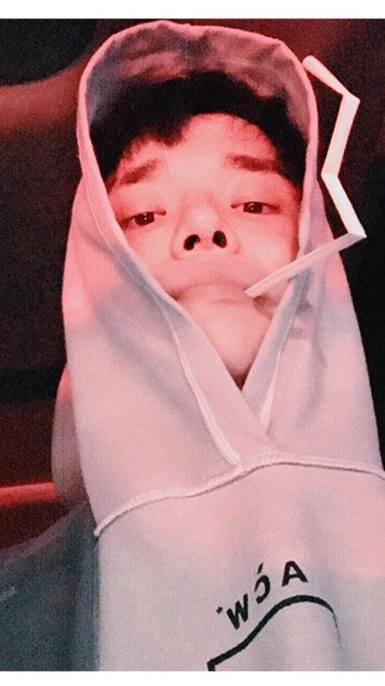
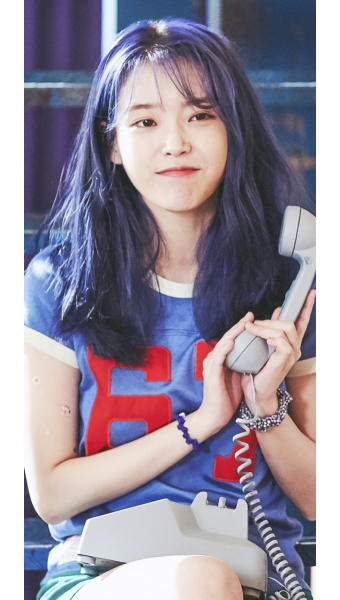
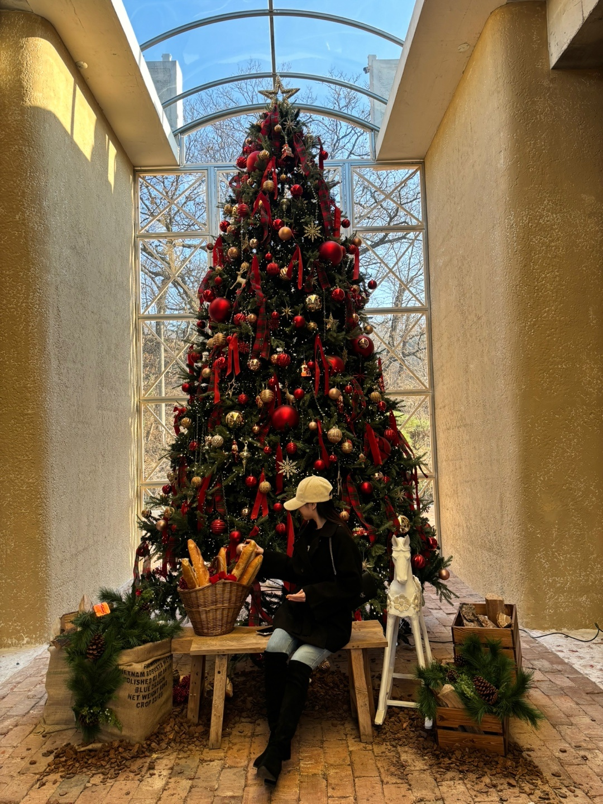
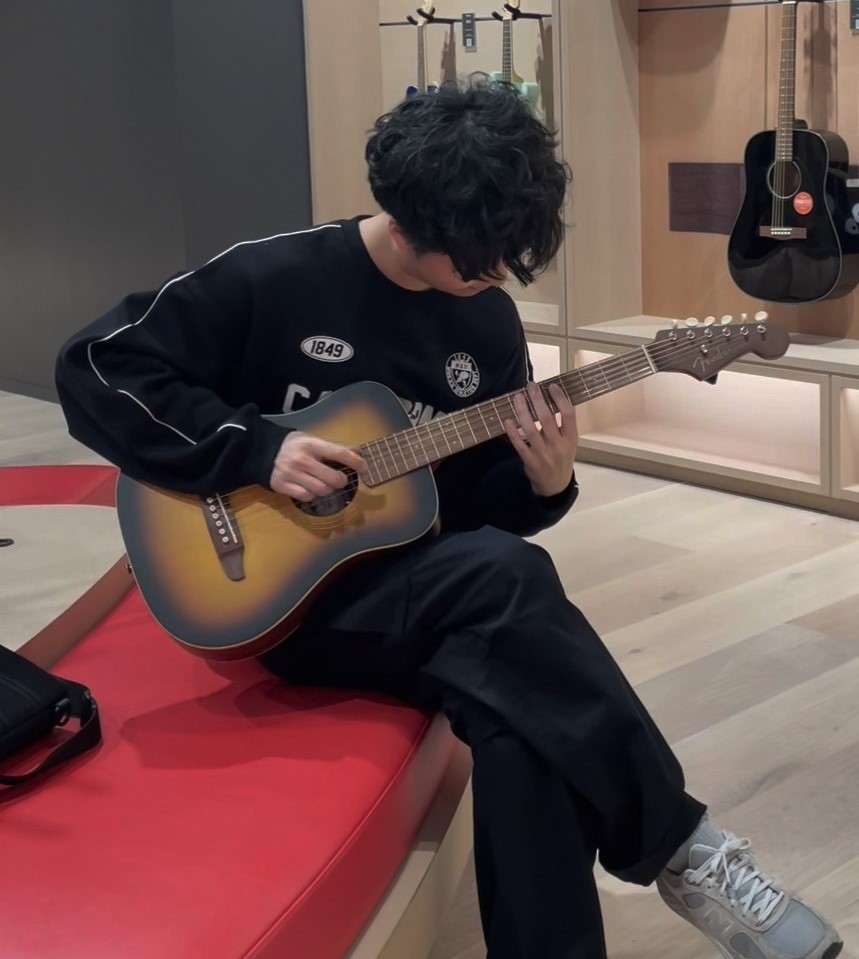
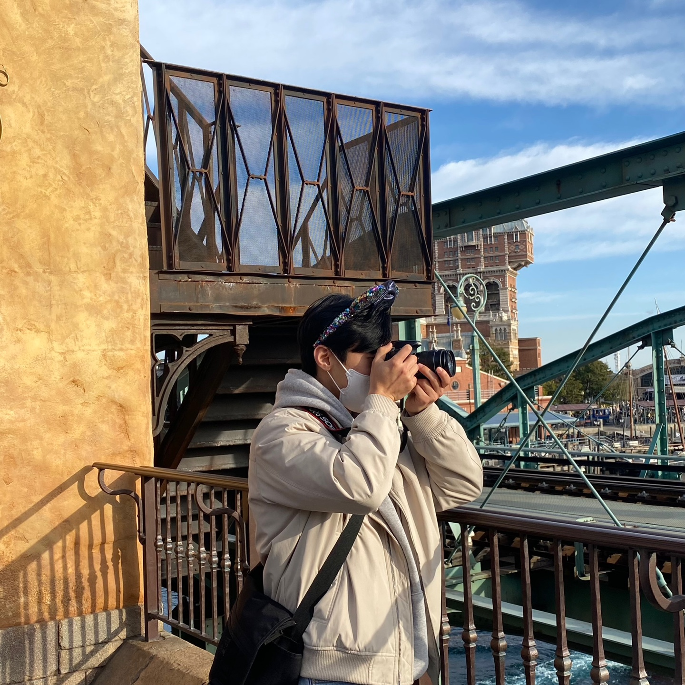

# SSAFY_CS_Study

### 🎯 진행 방식

노션: [노션](https://daisy-atmosphere-561.notion.site/SSAFY_CS_Study-f1610f222c93457ba13ed478955605ca?pvs=4)

시간: 매주 목요일

장소: 역삼

시간: 2시간 ~ 2시간 30분

주제: 네트워크, OS, DataBase

### 🎯 계획
- 선정된 한 사람이 **서술형 방식의 시험 문제** 준비
    - 시험 문제는 무조건 서술형
    - 출제자는 사전 학습 후 핵심 주제에 대해 시험 문제를 출제
        - 문제 수 : 5문제
        - 시험 시간 : 30 - 40분 (출제자가 판단)
- PR을 통해 풀이를 올린다.
- 시험 시간 종료 후 해설 PR을 확인하고 각자의 정답을 발표 후 공유 피드백 진행

### 📱 주차별 학습 분야

| 주차 | 분야 |
| --- | --- |
| 1주차 | OT |
| 2주차 | TCP, UDP  |
| 3주차 | HTTP, HTTPS |
| 4주차 | 네트워크: 데이터평면|
| 5주차 | 네트워크: 제어평면 |
| 6주차 | OS : OS 구조 |
| 7주차 | OS : 프로세스 |
| 8주차 | OS : 스레드 |

## 멤버 소개
|                           진주원                           |신권일|정연서|김수빈|김한얼|이태현|
|:-------------------------------------------------------:|:----:|:----:|:----:|:----:|:----:|
|      [@jinjoo-lab](https://github.com/jinjoo-lab)       |[@shin5774](https://github.com/shin5774)|[@yeondori](https://github.com/yeondori)|[@ksb3458](https://github.com/ksb3458)|[@yulmam](https://github.com/yulmam)|[@taehyeoon](https://github.com/taehyeoon)|
 |  | | | | | |
