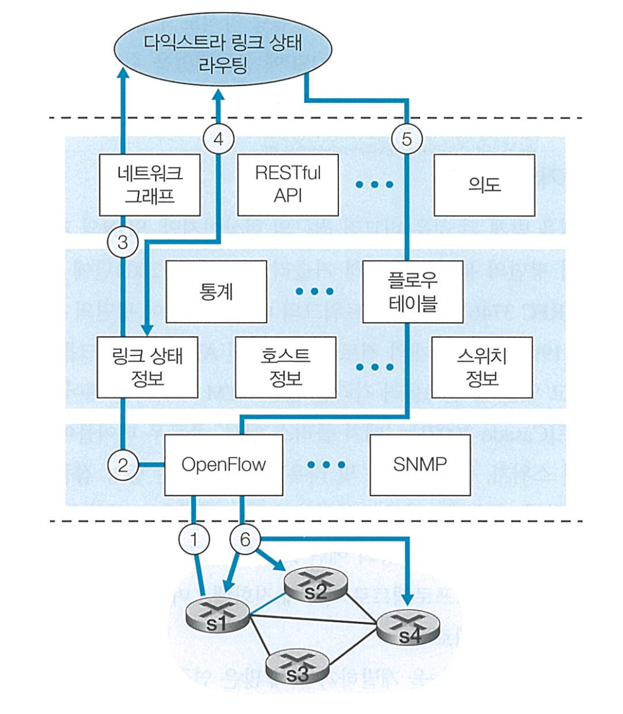

# [컴퓨터 네트워킹 하향식 접근] CHAPTER 8. 네트워크 계층: 제어 평면

### ⏰35min

## 1. 라우팅 알고리즘
### 라우팅 알고리즘은 중앙 집중형과 분산형으로 구분할 수 있다. 각 알고리즘에 대하여 특징을 서술하시오.
(필수 포함 키워드: 링크, 라우터, 비용)

> 중앙 집중형 라우팅 알고리즘 : 네트워크 전체에 대한 연결과, 링크 비용에 대한 완전한 정보를 가진 상태로 출발지와 목적지 사이의 최소 비용 경로를 계산한다.
> 출발지~목적지까지의 최소 비용 경로 계산은 논리적 중앙 집중형 컨트롤러에서 수행되거나, 모든 라우터 각각의 라우팅 모듈로 복사될 수 있다.
> 링크상태 알고리즘의 경우, 알고리즘이 네트워크 내 각 링크의 비용을 모두 알고 있는 경우 사용되는 알고리즘을 의미한다.

> 분산 라우팅 알고리즘 : 최소 비용 경로의 계산이 라우터들에 의해 반복적이고 분산된 방식으로 수행된다.
> 각 노드는 자신에게 직접 연결된 링크에 대한 비용 정보만을 가지고 있으며, 반복적인 게산과 이웃 노드와의 정보 교환을 통해 목적지까지의 최소 비용 경로를 계산한다.
> 거리 벡터 알고리즘의 경우, 각 노드가 네트워크 내의 다른 모든 노드까지의 거리의 추정값을 벡터로 유지하며, 최소 비용 경로를 계산한다.

## 2. 링크상태 라우팅 알고리즘, 거리벡터 라우팅 알고리즘

### 2-1 그림에서 확인할 수 있는 문제에 대해 설명하고, 문제의 원인과 해결방안에 대하여 간단히 설명하시오.
> 링크 상태 알고리즘에서 발생할 수 있는 진동(oscillation)문제로 네트워크에서 라우팅 경로가 불안정하게 변동되는 현상을 의미한다.

> 링크 비용이 해당 링크가 전달하는 트래픽 양에 의존하는 경우 발생할 수 있는 문제로, 모든 라우터가 동시에 링크 상태 알고리즘을 실행하지 못하게 함으로써 해결할 수 있다.

### 2-2. 거리 벡터 알고리즘의 특징 3가지를 서술하시오.
> 1. 분산적 : 각 노드는 하나 이상의 직접 연결된 이웃으로 부터 정보를 받으며, 계산을 수행하며, 계산 결과를 다시 이웃에게 배포한다는 점에서 분산적이다
> 2. 반복적 : 이웃끼리 더이상 정보를 교환하지 않을 때까지 프로세스가 지속된다는 점에서 반복적이다
> 3. 비동기적 : 모든 노드가 정확히 맞물려 동작할 필요가 없다는 점에서 비동기적이다.

### 2-3. 거리 벡터 라우팅 알고리즘에서 링크 비용 변경으로 인해 발생할 수 있는 문제와 원인에 대해 설명하시오.
> 두 노드 사이를 반복하며 순환하는 라우팅 루프에 빠질 수 있다.

> 네트워크 내의 링크 상태 변화가 동시에 여러 라우터에게 전달되지 않고, 순차적으로 전달되는 경우 발생하는 문제이다. 
> 노드가 알고 있는 정보는 자신과 연결된 링크의 정보만을 알고 있기 때문에 발생하는 문제이다. 자신과 연결된 링크의 비용이 감소한 경우, 빠르게 주변 노드로 링크 비용이 감소했다는 좋은 소식이 전달되지만, 링크 비용이 증가한 경우, 링크 비용이 증가했다는 나쁜 소식은 느리게 전달되기 때문에 발생한다.

## 3. BGP(Border Gateway Protocol)
### 뜨거운 감자 라우팅 알고리즘의 기본 아이디어를 설명하시오.
(포함 키워드 : AS, 비용, 패킷)
> 현재 패킷을 가지고 있는 라우터가 목적지까지의 경로 중 자신의 AS(Autonomous System) 바깥에 있는 부분에 대한 비용은 신경쓰지 않고, 최소한의 비용으로  패킷을 자신의 AS 바깥으로 내보내는 것이다.

## 4. SDN 컨트롤러 구성요소

### SDN 컨트롤러의 3가지 계층을 제시하고, 각 계층의 역할을 간략히 설명하시오.
> SDN 컨트롤러는 통신 계층, 네트워크 전역 상태관리 계층, 네트워크 제어 애플리케이션 계층으로 이루어져있다.

> 통신 계층에서는 사우스 바운드라고 알려진 컨트롤러 인터페이스를 통해 컨트롤러와 제어받는 네트워크 장치들 사이에서의 통신이 이루어진다. OpenFlow 프로토콜을 통해, 네트워크 장치(SDN기능이 가능한, 스위치, 호스트)는 컨트롤러에게 장치 주변에서 관찰한 이벤트를 알릴 수 있다.

> 네트워크 전역상태 관리 계층에서는 SDN제어 평면의 궁극적인 제어 결정을 위해서 컨트롤러가 “네트워크 호스트, 링크, 스위치”의 최신 정보를 관리하고, 다양한 제어 장치들의 플로우 테이블을 정보를 관리한다.

> 네트워크 제어 애플리케이션 계층에서는 노스바운드 인터페이스를 통해 네트워크 제어 애플리케이선과 상호작용한다. 이 API를 통해 제어 애플리케이션이 상태 관리 계층내의 네트워크 상태 정보와 플로우 테이블을 읽고 쓸 수 있다.

## 5. SDN 컨트롤러 시나리오

<<가정>>
> 스위치s1~s2 사이의 링크가 단절된 경우를 가정 
> 최단경로 알고리즘이 사용되고 있음 
> s1,s3,s4로 들어오고나가는 플로우 포워딩 규칙은 변경되었으나, s2동작은 바뀌지 않음 
> 통신 계층 프로토콜은 OpenFlow가 사용되며, 제어평면은 링크상태 라우팅이외의 기능은 수행하지 않음 

### 5-1. 위의 SDN 시나리오가 라우터별 제어 시나리오와 다른 2가지 차이점을 키워드를 포함하여 설명하시오.
(키워드 : 다익스트라 알고리즘, 링크 갱신 정보)
> 첫번째로, 다익스트라 알고리즘이 패킷 스위치 외부에서 별도의 애플리케이션으로 수행된다. 두번째로, 패킷 스위치들이 링크 갱신 정보를 서로간이 아닌 SDN 컨트롤러에게 전송한다.

### 5-2. 빈칸에 해당하는 적절한 과정을 설명하시오.

1. s2와의 단절을 감지한 s1은 OpenFlow의 포트상태 메세지를 사용하여 링크 상태의 변화를 SDN 컨트롤러에 알린다
2. 메세지를 받은 SDN 컨트롤러는 링크 상태 관리자에게 알리고, 관리자는 링크 상태 DB를 갱신한다
3. 다익스트라 링크상태 라우팅을 담당하는 네트워크 제어 어플리케이션은 링크 상태 변화에 대한 알림을 받는다
4. ( --- )
5. 라우팅 어플리케이션은 갱신되어야 할 플로우 테이블을 결정하는 플로우 테이블 관리자와 접촉한다
6. 플로우 테이블 관리자는 OpenFlow 프로토콜을 사용하여 영향을 받는 스위치들의 플로우 테이블을 갱신
> 링크 상태 라우팅 어플리케이션이 링크 상태 관리자에게 요청하여 갱신된 링크 상태를 받아와 새로운 최소 비용 경로를 계산한다

### 5-3. 6번 과정에서 링크 상태 변화에 영향을 받는 스위치의 번호를 제시하시오.
> 스위치 s1, s2, s4가 링크 상태 변화에 영향을 받는다.
