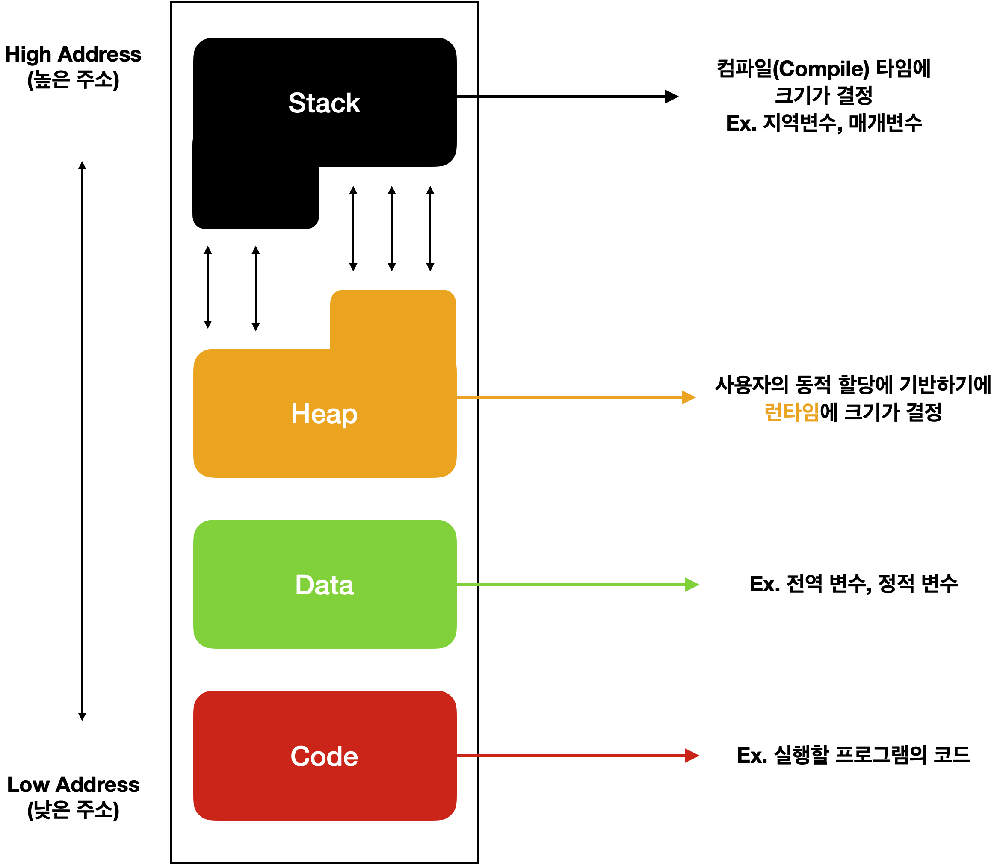
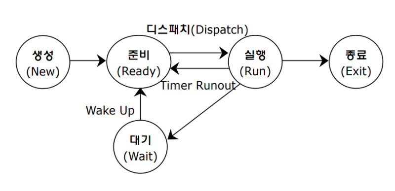

# 프로세스란?

- 실행중인 프로그램을 의미
- cpu 스케줄링의 대상이 되는 작업(Task)와 같은 의미
- 프로세스 내부에는 최소 하나의 스레드를 가지고 있음 → 실제로는 스레드 단위로 스케줄링함
- 프로세스는 각 메모리 공간을 시스템으로 부터 할당 받는다
- exe 프로그램을 실행 → 메모리에 실행할 데이터가 올라감 → cpu가 이 데이터의 코드를 한줄씩 읽어나가며 실행 : 이때 메모리에 올려진 데이터를 “프로세스”라고 한다

# 프로세스의 메모리 구조

- (프로세스 하나당 하나의 메모리를 가지고 있음)

### code 영역

- 프로그램을 실행 시키려는 실행 파일 내의 명령어들이 올라감(소스코드라고 생각할 수 있음)
- cpu는 code영역에서 명령어를 하나씩 가져와 처리
- 컴파일되어 0과 1로 변환된 기계어 저장

### data 영역

- 전역변수, 정적 변수, 상수 저장
- 초기화된 변수와 초기화되지 않는 변수가 나뉘어 저장된다
- 생성과 소멸 : 프로그램이 시작될때 할당, 프로그램 종료 시 소멸

[전역 변수를 위한 공간을 따로 둔 이유](전역%20변수를%20위한%20공간을%20따로%20둔%20이유.md)

### heap 영역

- 동적으로 생성되는 데이터 구조나 객체들을 저장
- 동적 할당을 위한 메모리 영역
- 메모리 주소 값에 의해서만 참조되고 사용되는 영역
- 크기 결정 : 런타임에 크기가 결정됨

### stack 영역

- 지역변수, 매개변수, return 주소 저장
- **잠시 사용되었다가 사라지는 데이터를 저장 함**
- 생성과 소멸 : 함수 호출시 생성, 함수 반환시 소멸
- 크기 결정 : 컴파일 타임에 크기가 결정

## 프로세스 스케줄링

cpu가 고속으로 여러 프로세스를 일정한 기준에 따라 순서를 정해서 실행

스케줄링

- cpu 할당 순서 및 방법을 결정하는 일(어떤 프로세스를 running 상태로 만들 것인지)
- 일정한 기준이란, scheduling 알고리즘
- 대부분의 OS에서 우선순위 알고리즘 + 라운드로빈 알고리즘 활용

프로세스 상태변화

ready, blocked, running

- new → ready
    - new 상태에서 프로세스가 생성되면, OS 커널에 존재하는 Ready Queue 올라간다
- ready → running
    - Ready Queue에 있는 프로세스들을 OS가 “프로세스 스케줄링 알고리즘”에 의해 Running 상태로 가야할 프로세스를 cpu로 할당
    - 이 프로세스는 running 상태가 됨
- running → ready
    - 현재 running 상태에 있는 프로세스 A보다 ready queue에서 대기하고 있는 프로세스 B의 우선순위가 높다면 → preemptive schedule(선점형)인 경우 → 프로세스 A는 ready 상태 → 프로세스 B는 running 상태(cpu 할당 받음)
- running → blocked
    - 현재 running 상태에 있는 프로세스 A에서 입출력 이벤트가 발생 했을 때 프로세스 A가 blocked 상태로 가게됨
- blocked → ready
    - 입출력 이벤트가 종료된 프로세스는 다시 ready상태로 돌아옴
- running → terminate
    - 프로세스 종료

### 주의

- ready, blocked 상태에는 여러 프로세스 존재 가능
- 싱글코어 CPU에서는 running  상태의 프로세스는 단 하나만 존재